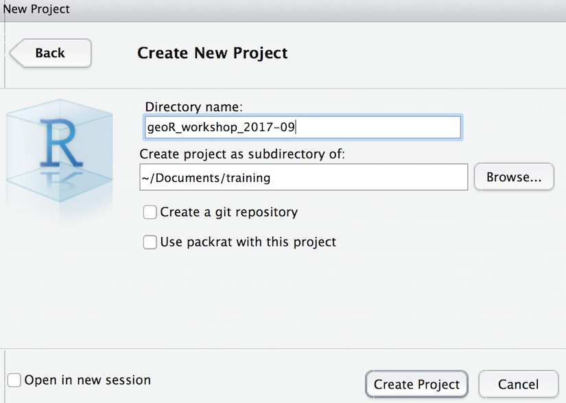

# Setup {#setup -}

## Install software

This workshop will require the following software installed on your machine:

- [R](http://cran.cnr.berkeley.edu/)
- [RStudio](https://www.rstudio.com/products/rstudio/download/#download)

Please download the appropriate stable release for your operating system.

## Launch RStudio

RStudio is an integrated development environment (IDE) for editing text in the code editor, running commands in the R console, viewing defined objects in the workspace and past commands in the history, and viewing plots, files and help. Here's a layout of the panes in RStudio, each of which can have several tabs for alternate functionality:


Check out the Help > Cheatsheets > [RStudio IDE Cheat Sheet](https://github.com/rstudio/cheatsheets/raw/master/rstudio-ide.pdf).

## Create RStudio project

In RStudio, please create an RStudio project (File > New Project... > New Directory > Empty Project) to organize your code and data for this workshop into a single folder. Feel free to organize this folder wherever makes sense on your laptop. Here's what I'm using:



### Create relative path to data folder

In order to work through a common set of code and access data files in a consistent manner, getting properly situated with paths will save many headaches. Paths can be referenced as an "absolute" path starting with your drive letter (eg "C:" on Windows or "/Users" on Mac). Absolute paths are specific to platform (Windows / Linux / Mac) and not portable for use on other machines or other users wishing to organize content anywhere else. A "relative" path, meaning relative to your current working directory, is portable. Try these commands in the console of RStudio:

```{r, eval=F}
# get working directory
getwd()

# list files in working directory
list.files('.')

# list files one directory up
list.files('..')

# create a directory
dir.create('data')

# set working directory
setwd('data')
setwd('..')
```

So you discovered the absolute path to your current working directory, and list files in the current directory (`.`) or one directory up (`..`). Then you created the "data" directory and set the working directory to be inside of it, then back out of it.

The main reason we created the RStudio project file (filename ends in `.Rproj`) is to have the same working directory every time you return to this project by double-clicking the `*.Rproj` file in your file explorer. So paths defined in the code of files there can be based on that same working driectory and consistently work, even if you zip them up and send to a colleague who places them on an arbitrary location on their computer.

## Download data

Please download the following zip files into your newly created "data" folder from above.

* [Site layout shapefiles](https://ndownloader.figshare.com/files/3708751)
* [Airborne remote sensing data](https://ndownloader.figshare.com/files/3701578)
* [Landsat NDVI raster data](https://ndownloader.figshare.com/files/4933582)
* [Meteorological data](https://ndownloader.figshare.com/files/3701572)

Then unzip. You should see the following when listing files (and directories) in the data directory.

```{r}
list.files('data')
```

## Install R Packages

Here's a bit of code to install packages that we'll use throughout the workshop. Please copy and paste this code into your console.

```{r, message=F, warning=F}
# concatenate a vector of package names to install
packages = c(
  # general data science
  'tidyverse',
  # dynamic document creation
  'knitr','rmarkdown',
  # handle spatial data
  'rgdal','raster','sp','sf','geojsonio',
  # spatial data
  'maps',
  # spatial analysis
  'rgeos','geosphere',
  # static plotting & mapping
  'RColorBrewer','ggplot2','rasterVis',
  # interactive plotting & mapping
  'plotly','leaflet','mapview','mapedit')

# loop through packages
for (p in packages){
  
  # if package not installed
  if (!require(p, character.only=T)){
    
    # install package
    install.packages(p)
  }
  
  # load package
  library(p, character.only=T)
}

# report on versions of software & packages
sessionInfo()
```


## Create Rmarkdown file

Rmarkdown is a dynamic document format that allows you to knit chunks of R code with formatted text (aka markdown). We recommend that you use this format for keeping a reproducible research document as you work through the lessons To get started, File > New File > Rmarkdown... and go with default HTML document and give any title you like (default "Untitled" or "test" or "First Rmd" is fine).

Check out the Help > Markdown Quick Reference and Help > Cheatsheets > [R Markdown Cheat Sheet](https://github.com/rstudio/cheatsheets/raw/master/rmarkdown-2.0.pdf).

Here's a 1 minute video on the awesomeness of Rmarkdown:

```{r, echo=F}
vembedr::embed_url("https://vimeo.com/178485416")
```


